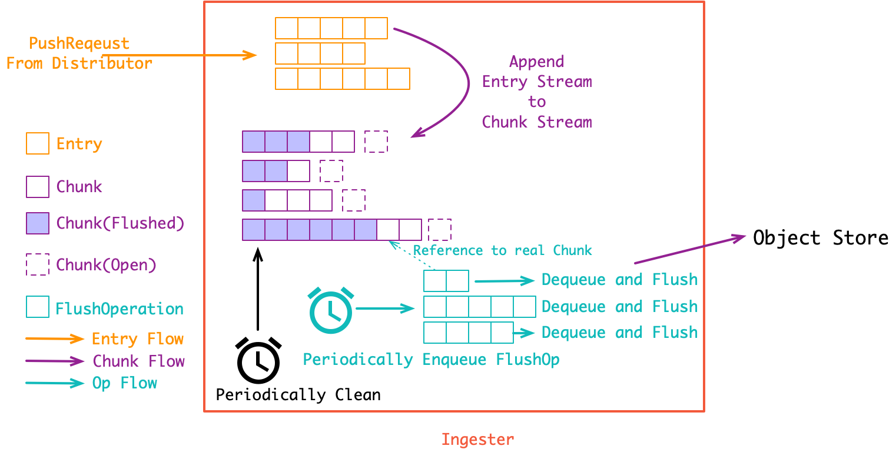

[TOC]

### ingester

`ingester` 接收 `distributor` 下发的 `PushRequest`, 也就是多段日志流(`[]Entry`). 在 `ingester`内部会先将收到的 `[]Entry` Append 到内存中的 Chunk 流(`[]Chunk`). 同时会有一组 `goroutine` 异步将 Chunk 流存储到对象存储当中:



#### grpc 接收日志流, 标签转化，存入内存

```go
//pkg/ingester/instance.go
// grpc 接收日志流
func (i *instance) Push(ct context.Context, req *logproto.PushRequest) error {
	i.streamsMtx.Lock()
	defer i.streamsMtx.Unlock()

	var appendErr error
	for _, s := range req.Streams {
    // 标签转换
		labels, err := util.ToClientLabels(s.Labels)
		if err != nil {
			appendErr = err
			continue
		}
 // 将收到的日志流 Append 到内存中的日志流上, 同样地, 日志流按 label hash 索引
		fp := client.FastFingerprint(labels)
		stream, ok := i.streams[fp]
		if !ok {
			stream = newStream(fp, labels)
            // 这个过程中, 还会维护日志流的倒排索引(label -> stream)
			i.index.Add(labels, fp)
			i.streams[fp] = stream
			i.streamsCreatedTotal.Inc()
		}

		if err := stream.Push(ctx, s.Entries); err != nil {
			appendErr = err
			continue
		}
	}

	return appendErr
}
```

```go
// 收集日志流
func (s *stream) Push(_ context.Context, entries []logproto.Entry) error {
	if len(s.chunks) == 0 {
		s.chunks = append(s.chunks, chunkDesc{
			chunk: chunkenc.NewMemChunk(chunkenc.EncGZIP),
		})
		chunksCreatedTotal.Inc()
	}

	// Don't fail on the first append error - if samples are sent out of order,
	// we still want to append the later ones.
	var appendErr error
	for i := range entries {
        // 假如当前 Chunk 已经关闭或者已经到达设定的最大 Chunk 大小, 则再创建一个新的 Chunk
		chunk := &s.chunks[len(s.chunks)-1]
		if chunk.closed || !chunk.chunk.SpaceFor(&entries[i]) {
			chunk.closed = true

			samplesPerChunk.Observe(float64(chunk.chunk.Size()))
			chunksCreatedTotal.Inc()

			s.chunks = append(s.chunks, chunkDesc{
				chunk: chunkenc.NewMemChunk(chunkenc.EncGZIP),
			})
			chunk = &s.chunks[len(s.chunks)-1]
		}
		if err := chunk.chunk.Append(&entries[i]); err != nil {
			appendErr = err
		}
		chunk.lastUpdated = entries[i].Timestamp
	}

	if appendErr == chunkenc.ErrOutOfOrder {
		return httpgrpc.Errorf(http.StatusBadRequest, "entry out of order for stream: %s", client.FromLabelPairsToLabels(s.labels).String())
	}

	return appendErr
}
```

`Chunk` 其实就是多条日志构成的压缩包. 将日志压成 `Chunk` 的意义是可以直接存入对象存储, 而对象存储是最便宜的(便宜是 loki 的核心目标之一). 在 一个 `Chunk` 到达指定大小之前它就是 open 的, 会不断 Append 新的日志(`Entry`) 到里面. 而在达到大小之后, `Chunk` 就会关闭等待持久化(强制持久化也会关闭 Chunk, 比如关闭 `ingester` 实例时就会关闭所有的 Chunk并持久化).

对 Chunk 的大小控制是一个调优要点:

- 假如 Chunk 容量过小: 首先是导致压缩效率不高. 同时也会增加整体的 Chunk 数量, 导致倒排索引过大. 最后, 对象存储的操作次数也会变多, 带来额外的性能开销;
- 假如 Chunk 过大: 一个 Chunk 的 open 时间会更长, 占用额外的内存空间, 同时, 也增加了丢数据的风险. 最后, Chunk 过大也会导致查询读放大, 比方说查一小时的数据却要下载整天的 Chunk;

#### 异步存储，一对多优先队列消费

异步存储过程就很简单了, 是一个一对多的生产者消费者模型:

```go
// 一个 goroutine 将所有的待存储的 chunks 存入队列 enqueue
// pkg/ingester/flush.go
func (i *Ingester) sweepStream(instance *instance, stream *stream, immediate bool) {
	if len(stream.chunks) == 0 {
		return
	}

	lastChunk := stream.chunks[len(stream.chunks)-1]
	if len(stream.chunks) == 1 && time.Since(lastChunk.lastUpdated) < i.cfg.MaxChunkIdle && !immediate {
		return
	}
 // 有一组待存储的队列(默认16个), 取模找一个队列把要存储的 chunk 的引用塞进去
	flushQueueIndex := int(uint64(stream.fp) % uint64(i.cfg.ConcurrentFlushes))
	firstTime, _ := stream.chunks[0].chunk.Bounds()
    // 写队列
	i.flushQueues[flushQueueIndex].Enqueue(&flushOp{
		model.TimeFromUnixNano(firstTime.UnixNano()), instance.instanceID,
		stream.fp, immediate,
	})
}
```

**每个队列都有一个 goroutine 作为消费者在消费队列 dequeue**

```go
// 每个队列都有一个 goroutine 作为消费者在消费队列 dequeue
func (i *Ingester) flushLoop(j int) {
	defer func() {
		level.Debug(util.Logger).Log("msg", "Ingester.flushLoop() exited")
		i.flushQueuesDone.Done()
	}()

	for {
		o := i.flushQueues[j].Dequeue()
		if o == nil {
			return
		}
		op := o.(*flushOp)

		level.Debug(util.Logger).Log("msg", "flushing stream", "userid", op.userID, "fp", op.fp, "immediate", op.immediate)
		// 实际的存储操作在这个方法中, 存储完成后, Chunk 会被清理掉
    // 存储，落盘
		err := i.flushUserSeries(op.userID, op.fp, op.immediate)
		if err != nil {
			level.Error(util.WithUserID(op.userID, util.Logger)).Log("msg", "failed to flush user", "err", err)
		}

		// If we're exiting & we failed to flush, put the failed operation
		// back in the queue at a later point.
        // 存储失败的 chunk 会重新塞回队列中
		if op.immediate && err != nil {
			op.from = op.from.Add(flushBackoff)
			i.flushQueues[j].Enqueue(op)
		}
	}
}
```

#### 刷盘，持久化

 i.flushUserSeries(op.userID, op.fp, op.immediate)

```go
func (i *Ingester) flushChunks(ctx context.Context, fp model.Fingerprint, labelPairs []client.LabelAdapter, cs []*chunkDesc) error {
	userID, err := user.ExtractOrgID(ctx)
	if err != nil {
		return err
	}
  // metric
	metric := client.FromLabelAdaptersToMetric(labelPairs)
	metric[nameLabel] = logsValue

	wireChunks := make([]chunk.Chunk, 0, len(cs))
	for _, c := range cs {
		firstTime, lastTime := c.chunk.Bounds()
    // chunk结构体
		c := chunk.NewChunk(
      // fp 以及时间, metric 标识
			userID, fp, metric,
			chunkenc.NewFacade(c.chunk),
			model.TimeFromUnixNano(firstTime.UnixNano()),
			model.TimeFromUnixNano(lastTime.UnixNano()),
		)
    // chunk 编码
		if err := c.Encode(); err != nil {
			return err
		}
		wireChunks = append(wireChunks, c)
	}
	
  // 写盘；调用对应的store client put 数据
	if err := i.store.Put(ctx, wireChunks); err != nil {
		return err
	}

	// Record statistsics only when actual put request did not return error.
	sizePerTenant := chunkSizePerTenant.WithLabelValues(userID)
	countPerTenant := chunksPerTenant.WithLabelValues(userID)
	for i, wc := range wireChunks {
		numEntries := cs[i].chunk.Size()
		byt, err := wc.Encoded()
		if err != nil {
			continue
		}

		chunkEntries.Observe(float64(numEntries))
		chunkSize.Observe(float64(len(byt)))
		sizePerTenant.Add(float64(len(byt)))
		countPerTenant.Inc()
		firstTime, _ := cs[i].chunk.Bounds()
		chunkAge.Observe(time.Since(firstTime).Seconds())
	}

	return nil
}
```

##### 调用cortex put 接口

```go
// cortex/pkg/chunk/composite_store
func (c compositeStore) Put(ctx context.Context, chunks []Chunk) error {
	for _, chunk := range chunks {
		err := c.forStores(chunk.From, chunk.Through, func(from, through model.Time, store Store) error {
			return store.PutOne(ctx, from, through, chunk)
		})
		if err != nil {
			return err
		}
	}
	return nil
}
```

##### 调用对应持久化模块的PutChunks接口

```go
// cortex/pkg/chunk/chunk_store
// PutOne implements ChunkStore
func (c *store) PutOne(ctx context.Context, from, through model.Time, chunk Chunk) error {
	userID, err := user.ExtractOrgID(ctx)
	if err != nil {
		return err
	}

	chunks := []Chunk{chunk}
	
  // 存chunk, 落盘
	err = c.storage.PutChunks(ctx, chunks)
	if err != nil {
		return err
	}

	c.writeBackCache(ctx, chunks)
  
  // 添加索引层信息到内存
	writeReqs, err := c.calculateIndexEntries(userID, from, through, chunk)
	if err != nil {
		return err
	}

  // 基于内存中的索引信息, 落盘
	return c.index.BatchWrite(ctx, writeReqs)
}
```

```go
// pkg/chunk/series_store.go
// calculateIndexEntries creates a set of batched WriteRequests for all the chunks it is given.
func (c *seriesStore) calculateIndexEntries(userID string, from, through model.Time, chunk Chunk) (WriteBatch, []string, error) {
	seenIndexEntries := map[string]struct{}{}
	entries := []IndexEntry{}
	keysToCache := []string{}

	metricName, err := extract.MetricNameFromMetric(chunk.Metric)
	if err != nil {
		return nil, nil, err
	}

	keys := c.schema.GetLabelEntryCacheKeys(from, through, userID, chunk.Metric)

	cacheKeys := make([]string, 0, len(keys)) // Keys which translate to the strings stored in the cache.
	for _, key := range keys {
		// This is just encoding to remove invalid characters so that we can put them in memcache.
		// We're not hashing them as the length of the key is well within memcache bounds. tableName + userid + day + 32Byte(seriesID)
		cacheKeys = append(cacheKeys, hex.EncodeToString([]byte(key)))
	}

	_, _, missing := c.writeDedupeCache.Fetch(context.Background(), cacheKeys)
	if len(missing) != 0 {
    /* 1/labelEntries  -- v9
     a. Entry for metricName -> seriesID
          seriesID := sha256bytes(labels.String())
          entries := []IndexEntry{
            // Entry for metricName -> seriesID
            {
              TableName:  bucket.tableName,
              HashValue:  bucket.hashKey + ":" + string(metricName),
              RangeValue: encodeRangeKey(seriesID, nil, nil, seriesRangeKeyV1),
            },
          } 
     b. Entries for metricName:labelName -> hash(value):seriesID
           {
           valueHash := sha256bytes(string(value))
          entries = append(entries, IndexEntry{
            TableName:  bucket.tableName,
            HashValue:  fmt.Sprintf("%s:%s:%s", bucket.hashKey, metricName, key),
            RangeValue: encodeRangeKey(valueHash, seriesID, nil, labelSeriesRangeKeyV1),
            Value:      []byte(value),
          }
	   We use a hash of the value to limit its length.
	   */
		labelEntries, err := c.schema.GetLabelWriteEntries(from, through, userID, metricName, chunk.Metric, chunk.ExternalKey())
		if err != nil {
			return nil, nil, err
		}

		entries = append(entries, labelEntries...)
		keysToCache = missing
	}
 
  // 2/chunkEntries  -- v9
  /*
  seriesID := sha256bytes(labels.String())
	encodedThroughBytes := encodeTime(bucket.through)

	entries := []IndexEntry{
		// Entry for seriesID -> chunkID
		{
			TableName:  bucket.tableName,
			HashValue:  bucket.hashKey + ":" + string(seriesID),
			RangeValue: encodeRangeKey(encodedThroughBytes, nil, []byte(chunkID), chunkTimeRangeKeyV3),
		},
	}
  */
	chunkEntries, err := c.schema.GetChunkWriteEntries(from, through, userID, metricName, chunk.Metric, chunk.ExternalKey())
	if err != nil {
		return nil, nil, err
	}
	entries = append(entries, chunkEntries...)

	indexEntriesPerChunk.Observe(float64(len(entries)))

	// Remove duplicate entries based on tableName:hashValue:rangeValue
	result := c.index.NewWriteBatch()
	for _, entry := range entries {
		key := fmt.Sprintf("%s:%s:%x", entry.TableName, entry.HashValue, entry.RangeValue)
		if _, ok := seenIndexEntries[key]; !ok {
			seenIndexEntries[key] = struct{}{}
			rowWrites.Observe(entry.HashValue, 1)
			result.Add(entry.TableName, entry.HashValue, entry.RangeValue, entry.Value)
		}
	}

	return result, keysToCache, nil
}
```

```go
//entries, err := c.schema.GetWriteEntries(from, through, userID, metricName, chunk.Metric, chunk.ExternalKey())

/* schema 为
pkg/chunk/schema_config.go
func (cfg PeriodConfig) createSchema() Schema{
var s schema
	switch cfg.Schema {
case "v9":
		s = schema{cfg.dailyBuckets, v9Entries{}}
		}
}
*/
```


##### 索引信息存入块存储nosql

```go
// cortex/pkg/chunk/local/boltdb_index_client.go
func (b *boltIndexClient) BatchWrite(ctx context.Context, batch chunk.WriteBatch) error {
	for table, kvps := range batch.(*boltWriteBatch).tables {
		db, err := b.getDB(table)
		if err != nil {
			return err
		}

		if err := db.Update(func(tx *bbolt.Tx) error {
			b, err := tx.CreateBucketIfNotExists(bucketName)
			if err != nil {
				return err
			}

			for key, value := range kvps {
        // key 
        // key := hashValue + separator + string(rangeValue)
				if err := b.Put([]byte(key), value); err != nil {
					return err
				}
			}

			return nil
		}); err != nil {
			return err
		}
	}
	return nil
}
```

##### 实际对象存入对象存储

```go
// cortexproject/cortex/pkg/chunk/aws/s3_storage_client.go
func (a s3ObjectClient) PutChunks(ctx context.Context, chunks []chunk.Chunk) error {
	var (
		s3ChunkKeys []string
		s3ChunkBufs [][]byte
	)

	for i := range chunks {
		buf, err := chunks[i].Encoded()
		if err != nil {
			return err
		}
		key := chunks[i].ExternalKey()

		s3ChunkKeys = append(s3ChunkKeys, key)
		s3ChunkBufs = append(s3ChunkBufs, buf)
	}

	incomingErrors := make(chan error)
	for i := range s3ChunkBufs {
		go func(i int) {
			incomingErrors <- a.putS3Chunk(ctx, s3ChunkKeys[i], s3ChunkBufs[i])
		}(i)
	}

	var lastErr error
	for range s3ChunkKeys {
		err := <-incomingErrors
		if err != nil {
			lastErr = err
		}
	}
	return lastErr
}
```

#### 定时清理

定时启动一个后台进程，每个一段时间(ingester.flush-check-period)默认30s，定时清理没有数据流的索引

```go
// pkg/ingester/ingester.go
func (i *Ingester) sweepInstance(instance *instance, immediate bool) {
	instance.streamsMtx.Lock()
	defer instance.streamsMtx.Unlock()

	for _, stream := range instance.streams {
		i.sweepStream(instance, stream, immediate)
    // 清理失效的日志流索引
		i.removeFlushedChunks(instance, stream)
	}
}
```

```go
// pkg/ingester/flush.go
func (i *Ingester) removeFlushedChunks(instance *instance, stream *stream) {
	now := time.Now()

	for len(stream.chunks) > 0 {
    // 时间间隔默认是15分钟
		if stream.chunks[0].flushed.IsZero() || now.Sub(stream.chunks[0].flushed) < i.cfg.RetainPeriod {
			break
		}
    // 通过优先队列，从前往后，一条一条的删除内存中历史流
		stream.chunks[0].chunk = nil // erase reference so the chunk can be garbage-collected
		stream.chunks = stream.chunks[1:]
	}

	if len(stream.chunks) == 0 {
		delete(instance.streams, stream.fp)
		instance.index.Delete(client.FromLabelAdaptersToLabels(stream.labels), stream.fp)
		instance.streamsRemovedTotal.Inc()
	}
}
```

最后是清理过程, 同样是一个单独的 goroutine 定时在跑. `ingester` 里的所有 `Chunk` 会在持久化之后隔一小段时间才被清理掉. 这个”一小段时间”由 `chunk-retain-time` 参数进行控制(默认 15 分钟). 这么做是为了加速热点数据的读取(真正被人看的日志中, 有99%都是生成后的一小段时间内被查看的).

#### 对象存储样式

```bash
# userId/fp/fromTime/toTime/CheckSum
```

#### 索引存储样式

```bash
# 1. Entries for metricName:labelName -> hash(value):seriesID

# 2. chunkEntries

# 3. metricName -> seriesID
```


